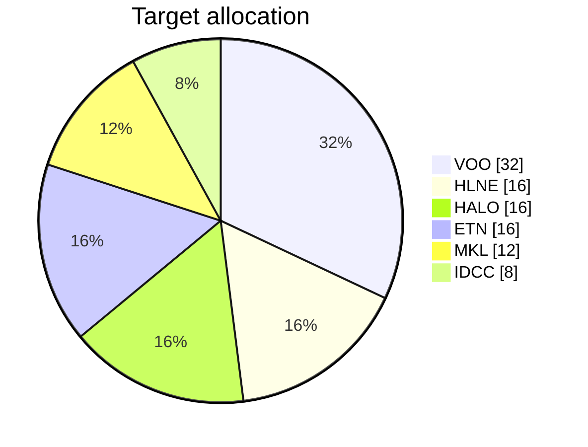

# Investment journal

Personal portfolio journal. Tracks target allocation, real cost-basis fills, and uses GitHub Issues + Claude GitHub Action to maintain weekly reviews, earnings event logs, and thesis re-checks.

> _This is a personal journal. Not financial advice._

## How it works

- **`portfolio/allocation.yml`** — target weights and per-ticker daily DCA amount.
- **`portfolio/trades.csv`** — actual fills, dividends, sales (cost-basis source of truth).
- **`portfolio/positions/*.md`** — one dossier per holding (thesis, risks, catalysts, valuation, earnings log).
- **`portfolio/dashboards/*.md`** — auto-rendered Mermaid visuals.
- **GitHub Issues** — earnings events, thesis reviews, weekly reviews, trade logs. Many issues use `[ ]` checkboxes that the Claude bot ticks when verifiable conditions are met.

## Workflows

| Workflow | When | What it does |
|----------|------|--------------|
| `weekly-review.yml` | Fri 21:30 UTC | Opens a weekly review issue with per-ticker updates, drift section, catalyst calendar |
| `earnings-watcher.yml` | Daily 13:00 UTC | Opens earnings issues 7 days ahead; posts recaps after the call |
| `claude-mention.yml` | `@claude` in any issue/comment | Claude responds inline |
| `update-dashboards.yml` | Push to `portfolio/**` | Regenerates dashboards + this README's portfolio block |
| `issue-checkbox-tick.yml` | Edit on any `auto-tick`-labeled issue | Claude ticks verifiable `[ ]` items |

## Dashboards

- [Allocation pie + drift table](portfolio/dashboards/allocation.md)
- [DCA flow](portfolio/dashboards/dca-flow.md)
- [Upcoming earnings](portfolio/dashboards/upcoming-earnings.md)

## Position dossiers

- [VOO — Vanguard S&P 500 ETF](portfolio/positions/VOO.md)
- [HLNE — Hamilton Lane](portfolio/positions/HLNE.md)
- [HALO — Halozyme Therapeutics](portfolio/positions/HALO.md)
- [ETN — Eaton Corp](portfolio/positions/ETN.md)
- [MKL — Markel Group](portfolio/positions/MKL.md)
- [IDCC — InterDigital](portfolio/positions/IDCC.md)

## Portfolio summary

<!-- portfolio-start -->
_Last refreshed: 2026-04-26_



| Ticker | Name | Target | Actual (cost-basis) | Drift (pp) | Shares | Total cost |
|---|---|---|---|---|---|---|
| VOO | Vanguard S&P 500 ETF | 32% | 0.00% | -32.00 | 0.0000 | $0.00 |
| HLNE | Hamilton Lane | 16% | 0.00% | -16.00 | 0.0000 | $0.00 |
| HALO | Halozyme Therapeutics | 16% | 0.00% | -16.00 | 0.0000 | $0.00 |
| ETN | Eaton Corp | 16% | 0.00% | -16.00 | 0.0000 | $0.00 |
| MKL | Markel Group | 12% | 0.00% | -12.00 | 0.0000 | $0.00 |
| IDCC | InterDigital | 8% | 0.00% | -8.00 | 0.0000 | $0.00 |

See [`portfolio/dashboards/allocation.md`](portfolio/dashboards/allocation.md) for the full breakdown including the actual cost-basis pie.
<!-- portfolio-end -->

## Setup (one-time, after first push to GitHub)

1. **Add repo secret** `ANTHROPIC_API_KEY` (Settings → Secrets and variables → Actions).
2. **Workflow permissions**: Settings → Actions → General → set workflow permissions to *Read and write*, allow Actions to create PRs.
3. **Manually run each workflow once** via `workflow_dispatch` to confirm wiring:
   ```bash
   gh workflow run update-dashboards.yml
   gh workflow run weekly-review.yml
   gh workflow run earnings-watcher.yml
   ```
4. **Pin the position issues** + the latest weekly review.

See [`docs/METHODOLOGY.md`](docs/METHODOLOGY.md) for how rundowns are produced and [`CLAUDE.md`](CLAUDE.md) for the agent guide.
