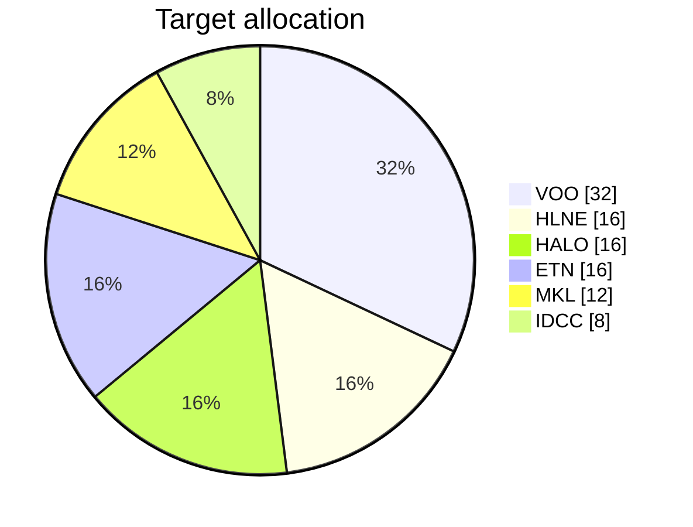

# Allocation

_Auto-generated by `scripts/render_dashboards.py`. Do not edit by hand._

```mermaid
pie showData title Target allocation
    "VOO" : 32
    "HLNE" : 16
    "HALO" : 16
    "ETN" : 16
    "MKL" : 12
    "IDCC" : 8
```
