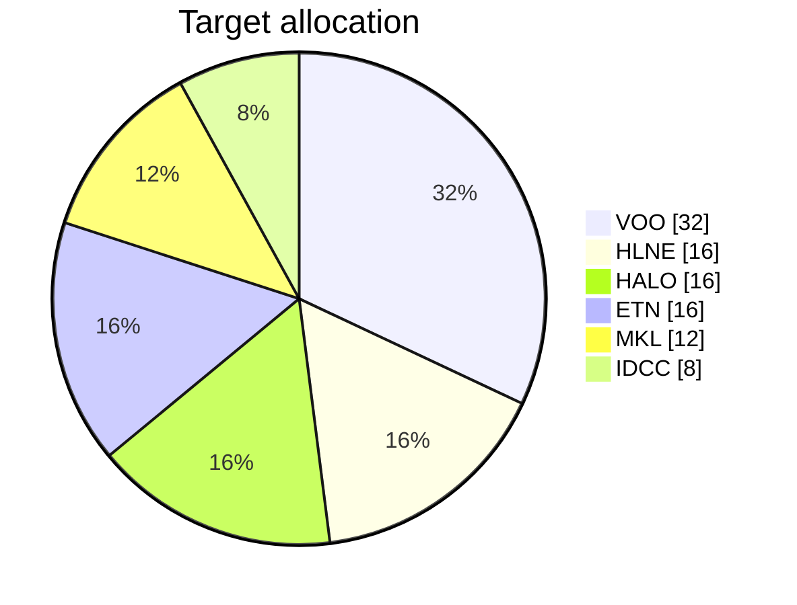

# Allocation

_Auto-generated by `scripts/render_dashboards.py`. Do not edit by hand._

## Target

## Actual (cost-basis)

_No trades logged yet. Actual allocation pie will appear after the first trade is recorded via the trade-log issue template._

## Drift

| Ticker | Target % | Actual % | Drift (pp) |
|---|---|---|---|
| VOO | 32 | 0.00 | -32.00 |
| HLNE | 16 | 0.00 | -16.00 |
| HALO | 16 | 0.00 | -16.00 |
| ETN | 16 | 0.00 | -16.00 |
| MKL | 12 | 0.00 | -12.00 |
| IDCC | 8 | 0.00 | -8.00 |

> Drift uses cost-basis weights (deterministic from `trades.csv`). Market-value drift is reported in the weekly review issue.
