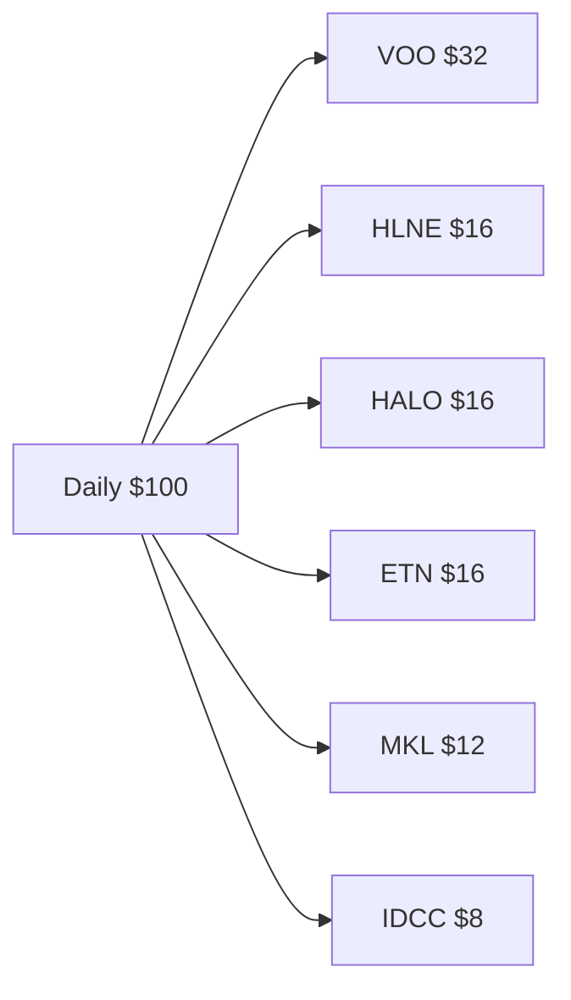
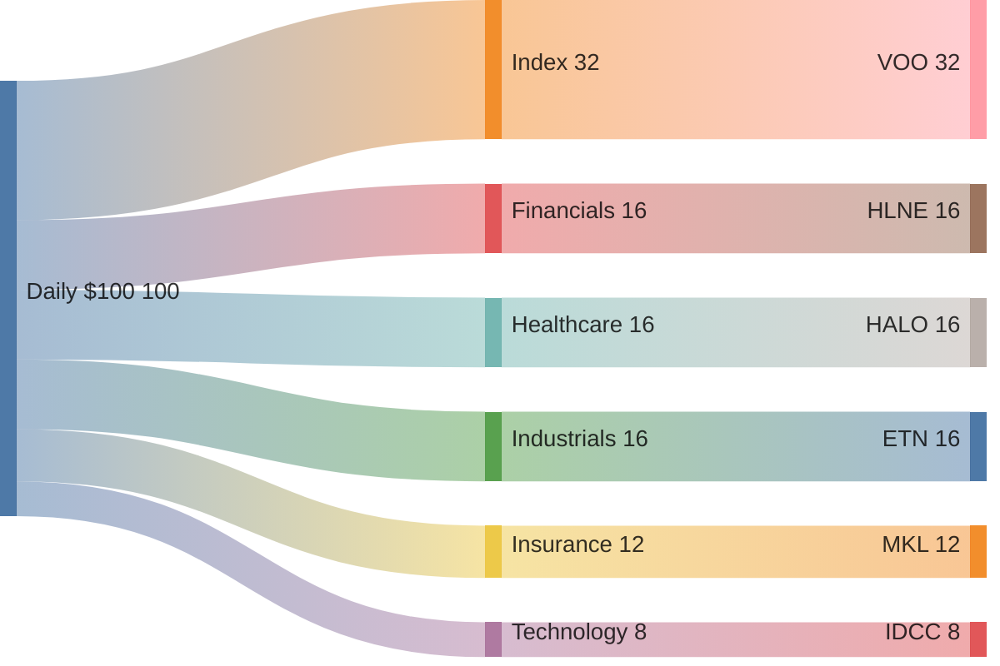

# Capital flow

_Auto-generated by `scripts/render_dashboards.py`. Do not edit by hand._

## Daily split (flowchart)

```mermaid
flowchart LR
  A["Daily $100"]
  A --> VOO["VOO $32"]
  A --> HLNE["HLNE $16"]
  A --> HALO["HALO $16"]
  A --> ETN["ETN $16"]
  A --> MKL["MKL $12"]
  A --> IDCC["IDCC $8"]
```

## Daily split (sankey, grouped by sector)

```mermaid
---
config:
  sankey:
    showValues: true
---
sankey-beta
Daily $100,Index,32
Daily $100,Financials,16
Daily $100,Healthcare,16
Daily $100,Industrials,16
Daily $100,Insurance,12
Daily $100,Technology,8
Index,VOO,32
Financials,HLNE,16
Healthcare,HALO,16
Industrials,ETN,16
Insurance,MKL,12
Technology,IDCC,8
```
