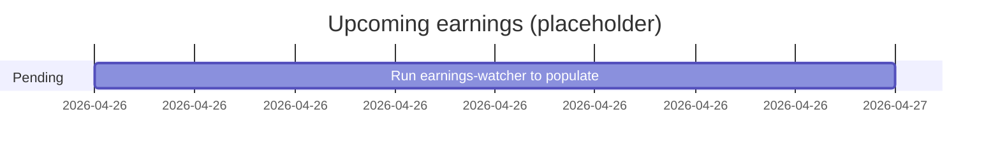

# Upcoming earnings

_Populated by `.github/workflows/earnings-watcher.yml`. Until the first run, this is empty._

```mermaid
gantt
    title Upcoming earnings (placeholder)
    dateFormat YYYY-MM-DD
    section Pending
    Run earnings-watcher to populate :a1, 2026-04-26, 1d
```
